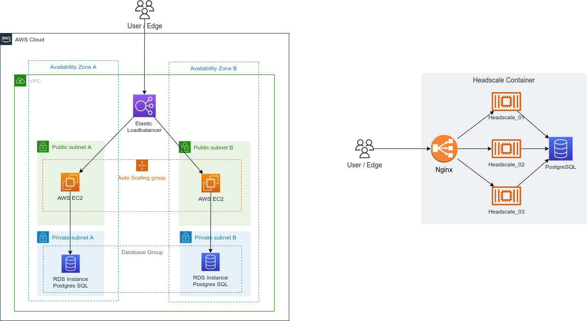

# Headscale High Availability with Docker-compose


Expected Architure

### *New version can be written by Terraform/Cloudformation for real traffic.
### This is a demo for test.

# To run
1. Clone this repo
2. Install docker and docker-compose
3. Run `sudo docker-compose up -d`

Note:
- Warning: `headscale/config.yaml` at 
```
# Postgres config
db_type: postgres
db_host: postgresql-db
db_port: 5432
db_name: app-database
db_user: user1
db_pass: user1234
```

- Use image: headscale/headscale:latest-debug 
    -> have shell & bash for debug
- Nginx loadbalancer expose url: `http://localhost:8080`.
    You can use Tailscale to connect to login-server by: 
    ```
    sudo tailscale up --login-server
    ```
    Then exec to container to confirm by: 
    ```
    sudo docker exec -it headscale-1 sh
    ```
    to ***run command*** in website.
- For quick authentication using **`preauthkeys`** by 
```
sudo docker exec -it headscale-1 sh
headscale --namespace <NAMESPACE_NAME> preauthkeys create --reusable --expiration 24h
```
Afterthat, your host can join network with 
```
tailscale up --login-server <YOUR_HEADSCALE_URL> --authkey <YOUR_AUTH_KEY>
```


